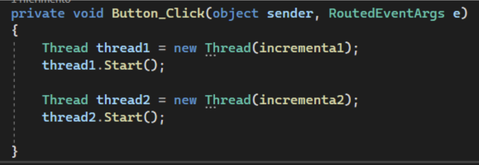
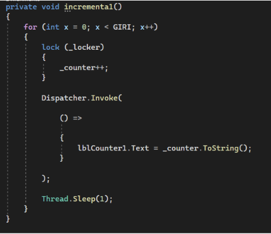
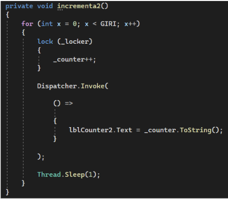
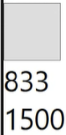
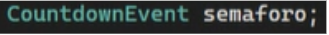
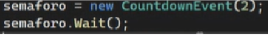
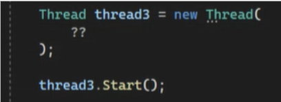
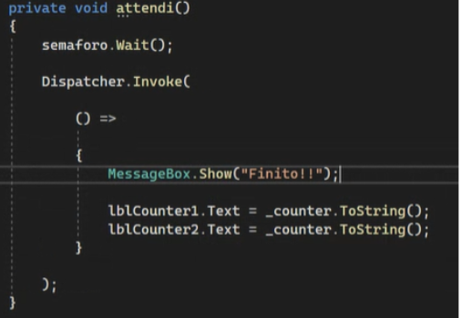
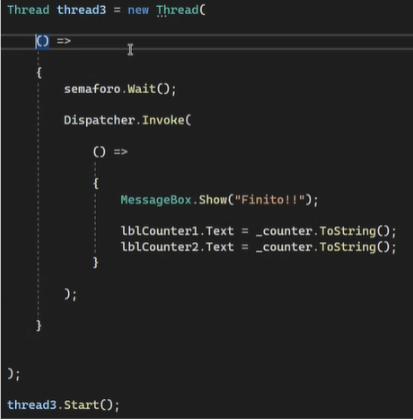
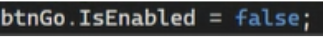

# WPFThreads
4i, ITTS O.Belluzzi L.da Vinci, 2022/2023

 

I thread non possono usare uno le risorse dell’altro.
Prima di eseguire una nuova azione si blocca a causa del Thread.Sleep.
Uno Lavora su lblCounter1 e l’altro lavora su lblCounter2.

Il lock garantisce l’atomicità delle cose.

Una volta fermato nessuno aggiorna più la prima label.

Il semaforo è un intero che non può essere negativo e ha due comandi:
-signal, decrementa il contatore
-wait, è una procedura bloccante 

Il semaforo non può essere utilizzato all’interno di un event handler per questo dobbiamo crearli un altro thread.

Possiamo anche meglio scriverlo rendendolo meglio leggibile così:

Con il metodo “dispatcher.Invoke” facciamo collaborare i due thread facendo in modo che non si blocchino.
Invoke ha un parametro di tipo lambda expression che si utilizza con =>

Per fare in modo che nessuno clicchi il pulsante durante l'esecuzione utilizziamo

che blocca momentaneamente il pulsante. 
E per farlo ripartire lo settiamo a true
